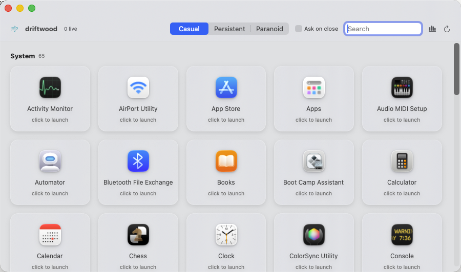
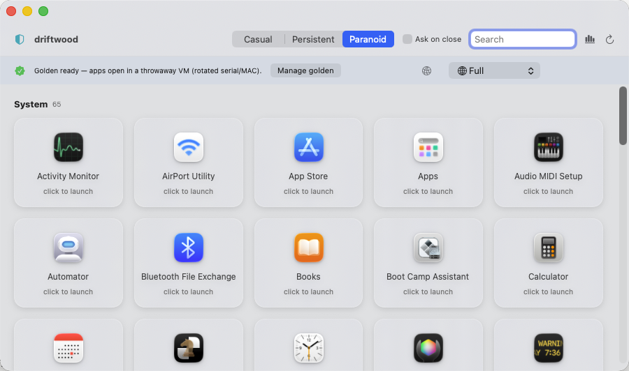

<div align="center">

# 🪵 driftwood

### Your Mac forgets you were ever there.

**A disposable-identity layer for macOS.** Rotate the hostnames that leak on
every network you join, and launch any installed app — App Store, system, or
third-party — inside a policy-enforced sandbox that ends the moment you close
the window.

[](#requirements)
[](LICENSE)
[](#driftwoodapp--native-launcher-gui)
[](driftwood.sh)

</div>

---

## Why you'd want this

**"I need to click a link I don't trust."**
Right-click any browser card → **Casual** (or set it globally) → launch. It
gets a completely fresh `~/Library` state — no cookies, no history, no saved
logins — and when you close it, that throwaway state is wiped and your real
profile is exactly as you left it.

**"I want to run this app with a new identity, routed through my VPN."**
Switch to **Paranoid**. driftwood clones a golden macOS image (instant,
copy-on-write), gives the clone a random MAC + serial number, connects your
Tailscale/ProtonVPN/WireGuard VPN *before* the VM boots, and opens the app
inside — where it stays until you close the window, at which point the entire
clone is deleted.

**"I want different network rules for different apps."**
The Paranoid network picker is per-launch: **Full** (shared NAT), **Isolated**
(no LAN visibility), **Offline** (no network at all), or any native VPN
driftwood finds on your Mac via `scutil --nc`. Pick Offline for a document
viewer, Full for a browser, your VPN for anything that should egress
somewhere specific.

**"I want to run an App Store app somewhere clean."**
This is the one place driftwood says "no" up front, on purpose: App Store
licenses are bound to your Apple ID and Secure-Enclave keys, so they can't be
anonymized. What you *can* do is install the app once into the golden VM
("Manage golden"), and after that every disposable clone runs it — clean OS,
no leftover state from the last session, just not a rotated identity for that
one app. See [The App Store reality](#the-app-store-reality).

---

## Threat model

Every Mac leaks a small constellation of identifiers the moment it touches a
network or opens an app:

- **Bonjour/mDNS broadcasts your `ComputerName`** to every device on the LAN —
  coffee-shop Wi-Fi, hotel networks, your friend's router. `"Joe's MacBook Pro"`
  is a name, a signal, and a cross-network correlation key, all at once.
- **Your Wi-Fi MAC** is a stable link-layer fingerprint every AP you associate
  with can log.
- **Every app you run accumulates state** — caches, cookies, UUIDs, saved
  application state — that ties your activity together across sessions even if
  you never signed into anything.
- **A GUI app is not a jail.** Even a "sandboxed" launch on stock macOS
  re-enters via LaunchServices and inherits your real environment, your real
  serial number, your real everything — unless it's run somewhere that isn't
  your host at all.

driftwood attacks this at two layers: it rotates what's safe to rotate on the
**host** (cosmetic identity — the network never needs your real name), and it
gives every app you launch a genuinely **disposable execution environment**
(state, process, or full hardware identity, depending on how paranoid you want
to be). What it will not do is pretend to solve problems it structurally
can't — see [Honest ceilings](#honest-ceilings) before you rely on it for
anything that matters.

---

## Privacy guarantees

| | driftwood defeats | driftwood does **not** |
|---|---|---|
| **LAN / Bonjour** | Real `ComputerName`/`LocalHostName` broadcast to every device on the network | — |
| **Cross-network correlation** | Same hostname/MAC following you from coffee shop to office to hotel | Correlation via your Apple ID / iCloud session (see below) |
| **Per-app state tracking** | An app building a fingerprint across launches (cookies, caches, saved UUIDs) — Casual policy gives it a fresh profile every time | `~/Library/Containers` state for *sandboxed* apps (App Store apps) — TCC-locked, Casual can't touch it |
| **Third-party fingerprinting inside a sandboxed app** | Hardware serial / MAC seen by an app running in a Paranoid VM — both are rotated per session | Fingerprinting by **Apple itself** while you're signed into iCloud (DSID-anchored — see [The iCloud caveat](#the-icloud-caveat)) |
| **Process confinement of arbitrary GUI apps** | Full isolation via a disposable macOS VM (Paranoid) — a real boundary | `sandbox-exec` confinement of a GUI app on the bare host — provably escapable (see below) |
| **Off-host launch traces** | Paranoid VM launches never touch the host's unified log at all | The host's unified log recording *native* app launches — no unprivileged tool can suppress this |
| **Anonymous App Store apps** | Nothing — this is a hard Apple constraint, not a driftwood limitation | Licenses are Secure-Enclave-bound to your Apple ID; there is no anonymous path |

---



---

## Quickstart

```bash
# GUI — no Xcode needed
cd app
./bundle.sh                              # swift build -c release, wraps driftwood.app
open driftwood.app                       # move to /Applications first (avoids a Downloads TCC prompt)

# CLI — host identity rotation
./driftwood.sh selfcheck                 # sanity-check the generators, no root, no changes
./driftwood.sh now --dry-run             # preview a rotation
sudo ./driftwood.sh now                  # rotate ComputerName/LocalHostName/HostName once
sudo DRIFTWOOD_INTERVAL_HOURS=6 DRIFTWOOD_ROTATE_MAC=1 ./driftwood.sh install
sudo ./driftwood.sh uninstall

# CLI — disposable per-app sandboxes
./driftwood.sh run --sandboxed Safari            # native app, fresh throwaway home, 0 GB
./driftwood.sh run --linux ubuntu -- bash        # throwaway Linux box
./driftwood.sh run --macos golden --app Safari   # native app in a disposable VM
```

---

## driftwood.app — native launcher (GUI)

A SwiftUI app that lists every installed app, grouped by source (App Store /
System / User / Applications), and launches each under a policy you choose —
globally, or per app.

**Builds with Command Line Tools only. No Xcode.**

```bash
cd app
./bundle.sh          # swift build -c release, wrapped into driftwood.app (ad-hoc signed)
open driftwood.app   # move it to /Applications first to skip the Downloads TCC prompt
```

`bundle.sh` calls `swift build -c release` and hand-assembles the `.app`
bundle (`Info.plist` + ad-hoc `codesign`) itself — there is no `.xcodeproj`
and no macro target, so Swift Package Manager + Command Line Tools is the
entire toolchain.

Requirements: Apple Silicon, macOS 13+. **Paranoid** additionally needs
[`tart`](https://github.com/cirruslabs/tart) (`brew install cirruslabs/cli/tart`)
and a one-time golden VM image, downloadable from inside the app.

### The three policies

| Policy | Mechanism | What rotates | Real confinement? |
|---|---|---|---|
| **Casual** | Native launch; the app's real `~/Library` state (Containers, Application Support, Preferences, Caches, cookies, saved state) is stashed to a journaled, crash-safe session dir before launch, then wiped (or archived, with *Ask on close*) | App-level state — fresh caches, cookies, saved UUIDs every launch | **No.** The app runs as a normal process on your real kernel with your real hardware identity — only its on-disk profile is ephemeral |
| **Persistent** | Normal launch, nothing stashed | Nothing | No — this is just "run the app" |
| **Paranoid** | Disposable macOS VM: instant APFS linked clone of a golden image, serial + MAC rotated, app launched inside the guest, clone destroyed on window close | **Hardware identity** (serial, MAC) + the entire OS instance | **Yes — the only policy with a real process/kernel boundary** |

Set policy globally from the top bar, or right-click any app card to override
it per-app (persisted, shown as a badge on the card).

> **Why not just sandbox the process on the host?** Because it doesn't hold.
> `sandbox-exec` was verified escapable against a real GUI app (the Athas
> editor) — the app relaunches itself via LaunchServices and steps outside
> the profile. And for App Store / system apps, the state that matters lives
> in `~/Library/Containers`, which is TCC-locked — no unprivileged tool
> (driftwood included) can stash-and-swap it. **Casual only fully isolates
> non-sandboxed apps.** The state-swap itself is engineered for a different
> failure mode — data loss, not confinement: intent is journaled *before*
> every move, restore only ever deletes a real path once its stashed
> replacement is confirmed present, "keep" archives your prior profile
> instead of deleting it, and a crash mid-session self-heals on next launch
> (`StateSwap.recoverAll()` runs on every app launch). If you need an actual
> boundary around an app, that's what Paranoid is for.

### Paranoid: disposable VMs



Selecting **Paranoid** surfaces the VM controls in the top bar:

- **Download golden (~25 GB, once)** — pulls
  `ghcr.io/cirruslabs/macos-sequoia-vanilla` to your SSD via `tart` (the exact
  size is set by the image publisher, not driftwood). Every
  session after this is an instant, ≈0-extra-disk **APFS copy-on-write linked
  clone** — not a fresh 25 GB copy.
- Each launch: `tart clone` the golden → `tart set --random-mac
  --random-serial` on the clone → boot → the target app opens **inside the
  guest** over SSH (`open -a`) → **the clone is deleted the moment the VM
  window closes.**
- **Network posture**, picked per session from the top bar:

  | Posture | Mechanism |
  |---|---|
  | **Full** | Shared NAT — the VM gets normal outbound access |
  | **Isolated** | `--net-softnet` — a private virtual network, off your LAN |
  | **Offline** | `--net-softnet --net-softnet-block=0.0.0.0/0` — softnet with everything blocked; no network at all |
  | **Route through a native VPN** | driftwood enumerates your macOS `NetworkExtension` VPNs (`scutil --nc list` — Tailscale, ProtonVPN, WireGuard, anything registered) and connects the one you pick, polling `scutil --nc status` for `Connected`, *before* the VM boots, so the guest's shared-NAT traffic egresses through it |

  The network posture is enforced **at the VM boundary only** — driftwood.app
  itself, running on the host, was never and can never be network-gated by
  this mechanism. This list is rebuilt from `scutil --nc list` every time the
  Paranoid bar appears, so any VPN profile you add on the host shows up
  automatically.

#### Lifecycle, one launch

```
click an app card (policy = Paranoid)
              │
              ▼
  tart clone driftwood-golden dw-<rand8>
  (APFS copy-on-write — ~0 extra disk, ~instant)
              │
              ▼
      isAppStore == true?
     ┌────────┴────────┐
    NO                 YES
     │                  │
     ▼                  ▼
tart set --random-mac   keep golden's MAC/serial
  --random-serial       (App Store receipt is machine-
                          bound; rotating it → exit 173)
     └────────┬────────┘
              ▼
  [optional] scutil --nc start <VPN>
  wait until "Connected" (native NetworkExtension:
  Tailscale / ProtonVPN / WireGuard) — up BEFORE boot
              ▼
  tart run <net-flags> dw-<rand8>   (VM window opens)
              ▼
      tart ip dw-<rand8> --wait 120
              ▼
ssh admin@<guest-ip> 'open -a "<App>" && echo DW_OK'
     ┌────────┴────────┐
already in golden   not in golden (non-MAS only)
     │                  │
     ▼                  ▼
opens instantly    scp the .app bundle in, then
                    open it from /Users/admin/
     └────────┬────────┘
              ▼
   app runs INSIDE the guest macOS —
   your host apps are not in this VM
              ▼
     user closes the VM window
              ▼
tart delete dw-<rand8>   (clone destroyed —
nothing about this session persists)
```

**Your installed host apps aren't inside the VM — it's a separate macOS
instance.** Two ways an app gets in:

- **Self-contained apps** (Electron bundles, direct downloads) are `scp`'d
  into the clone and opened — best-effort; some apps that expect installers
  or system frameworks won't run unmodified.
- **App Store & system apps** need one-time setup via **Manage golden**: boots
  the golden image read-write, opens the App Store — you sign in and install
  normally, then shut it down. Every clone made from that golden afterward
  carries the app, but **runs it without identity rotation**: the receipt is
  bound to the Apple ID and machine identity that installed it, and rotating
  serial/MAC on a clone that has one voids the receipt (the app exits `173`).
  Signing into the App Store during "Manage golden" authorizes that Apple ID
  on the golden exactly as it would on any Mac — driftwood just opens the App
  Store for you; the linking is Apple's doing, not driftwood's.

### The App Store reality

There is **no anonymous way to run an App Store app.** Its license is tied
to your Apple ID, and the cryptographic keys backing that receipt
(`Contents/_MASReceipt/receipt`) are Secure-Enclave-bound and non-copyable —
they can't be lifted into a clone with a different identity. Rotating a
clone's serial/MAC *after* an App Store app is installed makes the app reject
its own receipt outright (`exit 173`).

So driftwood's honest tradeoff: App Store and system apps run in every clone
**without** identity rotation for that clone — you get a clean, disposable OS
each time (no leftover state, no cross-session correlation from the app's own
data), but not a rotated hardware identity, because that identity is what the
receipt is checked against. This isn't a gap in driftwood — the license is
bound to your Apple ID and the authorization keys are Secure-Enclave-bound and
non-copyable by design. No tool can route around that.

### Activity & traces

The chart-icon button opens the inspector:

- **Live per-app CPU / memory / disk I/O / process count**, sampled every 2s
  and **summed across the entire process tree** per app — so Electron's
  helper processes count, not just the main one.
- driftwood's own **on-disk footprint**: active stashes and commit archives
  (protected — they hold your real data, never auto-deleted), plus orphaned
  temp homes and leftover VM clones (safe — one click, **Clean orphans**,
  wipes just those; it will never delete an active stash or an archive).

macOS doesn't expose per-process network usage to unprivileged apps, and
driftwood doesn't try to — the inspector tracks CPU/memory/disk, not network.
What the Paranoid VM adds is a per-*session* network posture for the whole VM
(Full / Isolated / Offline / VPN): a coarse boundary, not per-process
enforcement or observation. macOS's
unified log still records every native app launch on the host regardless of
policy; **only the Paranoid VM keeps a launch off the host log entirely**,
because the app never actually runs on the host. driftwood doesn't claim
otherwise.

Source: [`app/Sources/Driftwood/`](app/Sources/Driftwood/) —
`Store.swift` (app discovery, policies, monitoring), `StateSwap.swift`
(Casual's journaled stash/restore/commit), `VMManager.swift` (Paranoid VM
lifecycle + network posture), `Traces.swift` (footprint scan + purge),
`ContentView.swift` (UI).

---

## How it works

macOS has no single "machine ID" — identity is a **layered stack**: hardware
(serial, `IOPlatformUUID`, Secure Enclave), NVRAM (`ROM`/`MLB`), OS
(hostnames, MAC), and your Apple Account (**DSID**). Most layers either
**can't** be changed (hardware-bound) or **must not** be changed while you use
iCloud, because doing so de-registers Apple services out from under you.

So driftwood splits the job, Qubes/Whonix-style:

- **On the host**, it rotates only the cosmetic, safe layer — hostnames, and
  optionally the Wi-Fi MAC — and flatly refuses everything else.
- **For real isolation**, it runs each app in a **disposable sandbox**
  (state, process, or full VM) that's destroyed and re-identified on exit.

### The iCloud caveat

While you're fully signed into iCloud, host rotation only defeats **LAN and
third-party** tracking. It cannot decouple you from Apple: your **DSID** is
the anchor, and MobileGestalt (`MGCopyAnswer`) plus the Anisette/ADI auth
layer bind your hardware to that account regardless of hostname or MAC.
Defeating first-party Apple correlation means compartmentalizing iCloud
entirely — which is what the sandbox/VM layer is for, not host rotation.

---

## Host identity rotation

### Safe to rotate

| Identifier | Why it's safe | Who sees it |
|---|---|---|
| `ComputerName` / `LocalHostName` / `HostName` | Cosmetic; every service re-registers instantly | Broadcast to the whole LAN via Bonjour/mDNS — often leaks your real name |
| Wi-Fi MAC (opt-in) | Link-layer only; resets on reboot | Every network / router / AP you join |

### Refused — driftwood never touches these

| Identifier | What breaks if you rotate it |
|---|---|
| NVRAM `ROM` / `MLB` (iMessage identity pair) | De-registers iMessage & FaceTime; forces iCloud / Apple Pay re-auth |
| APNs push token | Breaks push for Mail, Messages, and every app that relies on it |
| Serial, `IOPlatformUUID`, Secure Enclave UID | Hardware-bound — can't actually be changed; trying only causes instability |
| Apple Account DSID | The master key of iCloud; changes only with a new Apple ID |

### Commands

```bash
./driftwood.sh now [--dry-run]     # rotate hostnames (+ Wi-Fi MAC if DRIFTWOOD_ROTATE_MAC=1)
./driftwood.sh install             # install the LaunchDaemon (env vars below)
./driftwood.sh uninstall
./driftwood.sh status              # current names / MAC / daemon state
./driftwood.sh selfcheck           # verify the generators
```

`install` drops a root `LaunchDaemon` (`com.driftwood.rotate`) that fires
every `DRIFTWOOD_INTERVAL_HOURS` and on boot.

| Env var | Default | Meaning |
|---|---|---|
| `DRIFTWOOD_INTERVAL_HOURS` | `6` | how often the daemon rotates |
| `DRIFTWOOD_ROTATE_MAC` | `0` | `1` = also rotate the Wi-Fi MAC |
| `DRIFTWOOD_PREFIX` | `Mac` | hostname prefix (e.g. `Mac-1a2b3c4d`) |

### Wi-Fi MAC: prefer the native feature

macOS already randomizes your MAC per network. Before setting
`DRIFTWOOD_ROTATE_MAC=1`, enable the built-in rotation — it's more reliable
and won't fight the OS:

> **Settings → Wi-Fi → (i) on your network → Private Wi-Fi Address → Rotating**

On Apple Silicon, `ifconfig <dev> ether` can be silently reverted on
association; driftwood logs a warning when that happens. Treat its MAC step
as a scheduled *supplement* to the native *Rotating* setting, not a
replacement for it.

---

## Disposable per-app sandboxes — `driftwood run`

Launch a single app in a throwaway environment that's **destroyed and
re-identified on exit**. Three backends, trading isolation against cost:

| Backend | One-time cost | Native macOS app? | What rotates | Isolation |
|---|---|---|---|---|
| `run --linux` | small image | no (Linux) | hostname + MAC + IP, fully ephemeral | own micro-VM |
| `run --sandboxed` | **0 GB** | **yes** | app state (fresh `$HOME`) | process confinement only; shares the host kernel + real serial |
| `run --macos` | ~25 GB once | **yes** | **MAC + serial** + a clean OS | full VM boundary; no iCloud in the guest |

Rule of thumb: **`--sandboxed`** for most native apps (instant, free, keeps
iCloud intact); **`--macos`** when the hardware serial specifically needs to
rotate; **`--linux`** for anything that runs on Linux.

### `--linux` — Linux app in a container

Apple's `container` gives each container its own micro-VM, IP, and MAC;
`--rm` deletes it on exit (cleanup is async — it briefly shows `stopped`,
then vanishes).

```bash
driftwood run --linux ubuntu -- bash        # fresh box; gone on exit
driftwood run --linux <image> --dry-run     # print the exact command first
```

Prereq: install Apple `container` (signed `.pkg` from its Releases), then
`container system start`. Needs macOS 26.

### `--sandboxed` — native macOS app, no VM (0 GB)

Runs the real `.app` on the host under a `sandbox-exec` profile with a
throwaway `$HOME` (wiped on exit). Instant, no download, keeps iCloud intact.
It rotates *app-level* state only — a fresh home each run means fresh caches,
cookies, and UUIDs — and blocks the app from writing to your real home;
`--no-net` also cuts network. It does **not** rotate the hardware serial —
the app still reads the host's real serial via IOKit.

```bash
driftwood run --sandboxed Safari            # fresh throwaway home, wiped on quit
driftwood run --sandboxed Notes --no-net    # ...and no network
driftwood run --sandboxed /path/App.app     # app name, .app path, or binary path
#   --keep   keep the temp home for inspection
```

`sandbox-exec` is deprecated-but-present; reliable for CLI tools and simple
apps. GUI apps that relaunch via LaunchServices/XPC, or read global prefs
through `cfprefsd`, can partially escape the fresh-home redirect. For hard
isolation **and** serial rotation, use `--macos`.

### `--macos` — native macOS app in a disposable VM

The only way to run a real `.app` ephemerally with a *rotated hardware
identity*. `driftwood run --macos` clones a golden VM, gives it a **fresh MAC
+ serial** (`tart set --random-mac --random-serial`), launches one app over
SSH, and **deletes the clone when you close the VM window**.

```bash
driftwood run --macos macos-golden --app Safari
driftwood run --macos macos-golden --app Notes --dry-run   # preview the lifecycle
#   --no-rotate  keep the identity     --keep  don't destroy on exit
#   DRIFTWOOD_VM_USER  guest SSH user (default 'admin')
```

> **App Store apps via the CLI:** unlike the GUI, `driftwood.sh` does **not**
> auto-detect App Store apps — pass `--no-rotate` for them, or the rotated
> identity voids the receipt (`exit 173`).

**Prepare the golden once** (needs `tart`):

```bash
brew install cirruslabs/cli/tart

# Fastest — prebuilt image with an 'admin' user + Remote Login (SSH) already set:
tart clone ghcr.io/cirruslabs/macos-sequoia-vanilla:latest macos-golden

# Or from scratch (interactive Setup Assistant): create an 'admin' user, enable
# Remote Login (Settings → General → Sharing), sign OUT of iCloud, shut down:
tart create --from-ipsw=latest macos-golden && tart run macos-golden
```

Golden images are tens of GB — that one-time pull dominates setup. Every
per-app clone after it is copy-on-write (≈ no extra disk).

**Limits:**

- macOS guest VMs **can't sign into iCloud/iMessage** (a
  Virtualization.framework limit), so this rotates hardware identity for
  fingerprinting purposes, not Apple first-party correlation.
- Auto-launch needs **Remote Login** enabled in the golden; without it the VM
  still boots and self-destructs on close — you just open the app manually.
- macOS licensing caps ~2 concurrent macOS VMs per host. `--linux` is
  unlimited.
- Want the Whonix property (guest never learns your real IP)? Chain the VM
  through a Tor/VPN gateway VM. Alternatives to `tart`: UTM, Lima/Colima.

---

## Honest ceilings

Presented as credibility, not fine print — these are the walls we hit, and we'd
rather you know them going in:

1. **You can't process-jail an arbitrary GUI app on the bare host.**
   `sandbox-exec` is deprecated and escapable — verified by launching the
   Athas editor under it and watching it step outside the profile via
   LaunchServices. This is why Paranoid exists as a wholly separate tier.
2. **`~/Library/Containers` is TCC-locked.** Sandboxed apps (most App Store
   titles) keep their real state there, which no unprivileged tool — driftwood
   included — can stash and swap. **Casual only fully isolates non-sandboxed
   apps.**
3. **The Paranoid VM is a separate macOS instance.** Your host-installed apps
   are not "in" it; getting an app in means copying a self-contained bundle or
   installing it into the golden once.
4. **There is no anonymous way to run App Store apps.** The license is tied
   to your Apple ID and the authorization keys are Secure-Enclave-bound and
   non-copyable — this is an Apple platform constraint, full stop.
5. **While signed into iCloud, nothing decouples you from Apple.** The Apple
   Account **DSID** is the anchor, and MobileGestalt/Anisette-ADI bind your
   hardware to that account regardless of hostname, MAC, or VM identity.

**driftwood defeats LAN and third-party fingerprinting and per-app state
tracking, and it gives you disposable, rotated hardware identity inside the
VM. It does not make you anonymous to Apple.** If a tool tells you otherwise,
be skeptical of that tool.

---

## Security notes

- The daemon runs as **root**. `install` copies the script to
  `/usr/local/sbin/driftwood` (`root:wheel`, `0755`) and writes the plist
  (`root:wheel`, `0644`), so a non-root user can't rewrite what root executes.
  Don't point the daemon at a script in a user-writable directory.
- Everything is reversible: `uninstall` removes the daemon and the installed
  copy; rotated names and MACs reset naturally.
- It's a single audited bash script with no network calls of its own — read
  it before you run it as root. ([`driftwood.sh`](driftwood.sh))

---

## Inspect your own identifiers

Read-only; values stay on your machine:

```bash
scutil --get ComputerName; scutil --get LocalHostName
ioreg -rd1 -c IOPlatformExpertDevice | grep -E 'UUID|Serial'   # hardware-bound, informational
ifconfig "$(networksetup -listallhardwareports | awk '/Wi-Fi/{getline;print $2;exit}')" | grep ether
nvram -p | grep -Ei 'ROM|MLB'                                  # DO NOT rotate these
```

---

## Requirements

| Feature | Needs |
|---|---|
| Host rotation (`now` / `install`) | macOS 13+ |
| `driftwood.app` (GUI) — Casual / Persistent | Apple Silicon, macOS 13+, Command Line Tools (no Xcode) |
| `driftwood.app` (GUI) — Paranoid | above, + [`tart`](https://github.com/cirruslabs/tart) + a one-time golden VM |
| `run --sandboxed` | any macOS (built-in `sandbox-exec`) |
| `run --linux` | macOS 26 + Apple [`container`](https://github.com/apple/container) |
| `run --macos` | Apple Silicon + [`tart`](https://github.com/cirruslabs/tart) + a one-time golden VM |

---

## Scope & ethics

A personal-privacy tool for hardware **you own**. It reduces cross-network and
third-party fingerprinting and gives you disposable, policy-scoped app
execution. It is not an anti-forensics or fraud tool, and — see above — it
cannot make you anonymous to Apple while you're signed into iCloud.

---

## License

MIT — see [LICENSE](LICENSE).
